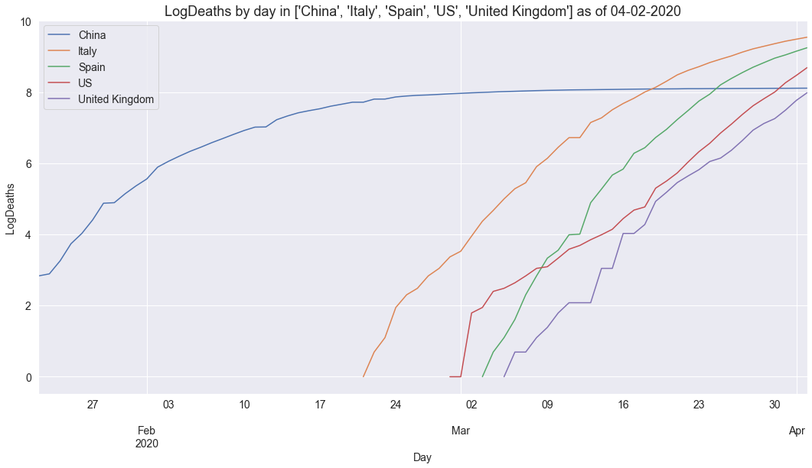

# covid <a name="top-of-covid-notebook"></a>
> Visualise the John Hopkins Covid-19 dataset.


## Contents
1. [Introduction](#covid-intro)
2. [Installation](#covid-install)
3. [Graphing current counts](#covid-current)
4. [Graphing time series counts](#covid-timeseries)
5. [Graphing current and time series counts using Covid API](#covid-api)

## 1. Introduction <a name="covid-intro"></a>
#### [back](#top-of-covid-notebook)

The `covid` module provides convenience utilities for graphing the covid-19 dataset published by John Hopkins University (JHU) [here](https://github.com/CSSEGISandData/COVID-19).  The JHU dataset is updated daily with the latest in separate time series csv files covering [here](https://github.com/CSSEGISandData/COVID-19/tree/master/csse_covid_19_data/csse_covid_19_time_series):
* time_series_covid19_confirmed_global.csv
* time_series_covid19_deaths_global.csv
* time_series_covid19_recovered_global.csv

Daily reports are kept in [this directory](https://github.com/CSSEGISandData/COVID-19/blob/master/csse_covid_19_data/csse_covid_19_daily_reports) and conform to the format `dd-mm-2020.csv`.

## 2. Installation <a name="covid-install"></a>
#### [back](#top-of-covid-notebook)

This code is not yet in PyPI.  You can clone the repo and the corresponding functions described below will all be available in the accompanying `covid` module.  The `covid` module has the following dependencies which will need to be pip installed: `pandas`,`matplotlib`,`seaborn`,`requests`

## 3. Graphing current counts <a name="covid-current"></a>
#### [back](#top-of-covid-notebook)

You can use `getDailyReport` to obtain a `pandas` dataframe holding the latest values for each of `["Confirmed","Deaths","Recovered"]` by both `Province_State` and `Country_Region` as follows:

```python
df = getDailyReport(getYesterday())
df.columns.to_list()
```


    ['FIPS',
     'Admin2',
     'Province_State',
     'Country_Region',
     'Last_Update',
     'Lat',
     'Long_',
     'Confirmed',
     'Deaths',
     'Recovered',
     'Active',
     'Combined_Key']


You can plot this data aggregated by country and `kind` as follows:

```python
setDefaults()
plotDailyReport(getDailyReport(getYesterday()), color='r', kind='Deaths')
```


## 4. Graphing time series counts <a name="covid-timeseries"></a>
#### [back](#top-of-covid-notebook)

We can look at how the counts have varied for a county over time if we aggregate by doing a `groupby` on `country`.  We should see an equal number of values per country following this aggregation:  

```python
df = procTimeSeriesConfirmed()
print(f'Found {df.shape} (rows, cols) of cols={df.columns.values}')
ddf = df.groupby('country')['confirmed'].count().sort_values(ascending=True)
print(f'max={ddf.max()}, min={ddf.min()}, count={len(ddf)}')
```

    Found (11859, 2) (rows, cols) of cols=['country' 'confirmed']
    max=67, min=67, count=177


Now we can plot a time series of confirmed cases in China, Italy, US and UK as follows:

```python
plotCountryTimeSeries(df, ['China', 'Italy', 'US', 'United Kingdom'], 'Confirmed infections')
```


And we can plot a time series of recorded deaths in these same countries as follows:

```python
plotCountryTimeSeries(procTimeSeriesDeaths(), ['China', 'Italy', 'US', 'United Kingdom'], 'Deaths')
```


## 5. Graphing current and time series counts using Covid API <a name="covid-api"></a>
#### [back](#top-of-covid-notebook)

[This site](https://covid19api.com/) details an API that nicely wraps up the same JHU dataset and presents it as `json` via a REST API which allows us to go from API call to formatted graph showing cases and deaths by country as follows:

```python
import requests, pandas as pd

df = pd.DataFrame(requests.get('https://api.covid19api.com/summary').json().get('Countries')).\
  sort_values(by=['TotalConfirmed'], ascending=False)
_ = df[df.TotalDeaths > 10].plot(kind='bar', x='Country', y=['TotalConfirmed', 'TotalDeaths'],\
  color='yr', stacked=True, figsize=(18, 9)).set_title('Covid-19 cases and deaths', size=18)
```


Note that not all the country names are fully normalised.

It's also possible to do timeseries representation using this API by country:

```python
def plotCategoryByCountry(category, country, color='y'):
    url = f'https://api.covid19api.com/total/country/{country}/status/{category}'
    df = pd.DataFrame(requests.get(url).json())
    df['Date'] = df['Date'].apply(pd.to_datetime)
    df.plot(kind='line', x='Date', y='Cases', color=color, figsize=(18, 9)).\
      set_title(f'Covid-19 {category} in {country}', size=18)

plotCategoryByCountry('confirmed', 'united-kingdom')
```





```python
plotCategoryByCountry('deaths', 'united-kingdom', color='r')
```


