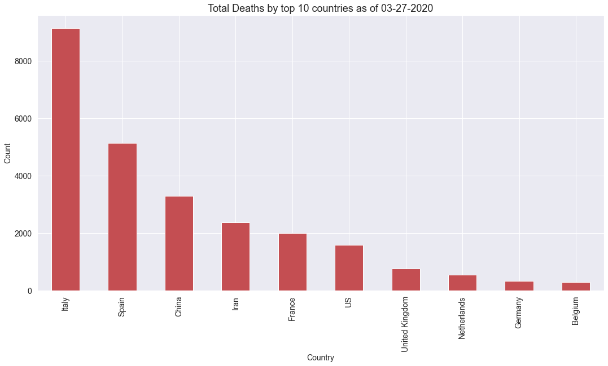
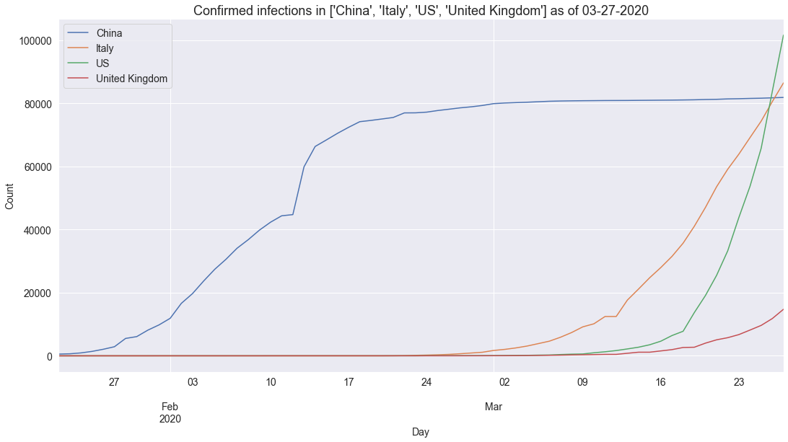
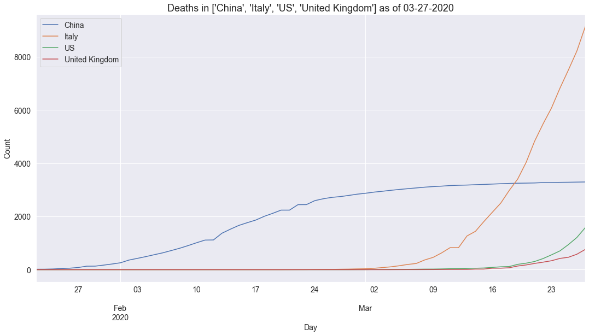

# covid
> Module 


The `covid` module provides convenience utilities for graphing the covid-19 dataset published by John Hopkins University (JHU) [here](https://github.com/CSSEGISandData/COVID-19).  The JHU dataset is updated daily with the latest in separate time series csv files covering [here](https://github.com/CSSEGISandData/COVID-19/tree/master/csse_covid_19_data/csse_covid_19_time_series):
* time_series_covid19_confirmed_global.csv
* time_series_covid19_deaths_global.csv
* time_series_covid19_recovered_global.csv

Daily reports are kept in [this directory](https://github.com/CSSEGISandData/COVID-19/blob/master/csse_covid_19_data/csse_covid_19_daily_reports) and conform to the format `dd-mm-2020.csv`.

## Install

This code is not yet in PyPI.  The corresponding functions described below are all available in the accompanying `covid` module.

## How to use

### Graphing current counts

You can use `getDailyReport` to obtain a `pandas` dataframe holding the latest values for each of `["Confirmed","Deaths","Recovered"]` by both `Province_State` and `Country_Region` as follows:

```python
df = getDailyReport(getYesterday())
df.head()
```


<div>
<style scoped>
    .dataframe tbody tr th:only-of-type {
        vertical-align: middle;
    }

    .dataframe tbody tr th {
        vertical-align: top;
    }

    .dataframe thead th {
        text-align: right;
    }
</style>
<table border="1" class="dataframe">
  <thead>
    <tr style="text-align: right;">
      <th></th>
      <th>FIPS</th>
      <th>Admin2</th>
      <th>Province_State</th>
      <th>Country_Region</th>
      <th>Last_Update</th>
      <th>Lat</th>
      <th>Long_</th>
      <th>Confirmed</th>
      <th>Deaths</th>
      <th>Recovered</th>
      <th>Active</th>
      <th>Combined_Key</th>
    </tr>
  </thead>
  <tbody>
    <tr>
      <th>0</th>
      <td>45001.0</td>
      <td>Abbeville</td>
      <td>South Carolina</td>
      <td>US</td>
      <td>2020-03-27 22:14:55</td>
      <td>34.223334</td>
      <td>-82.461707</td>
      <td>4</td>
      <td>0</td>
      <td>0</td>
      <td>0</td>
      <td>Abbeville, South Carolina, US</td>
    </tr>
    <tr>
      <th>1</th>
      <td>22001.0</td>
      <td>Acadia</td>
      <td>Louisiana</td>
      <td>US</td>
      <td>2020-03-27 22:14:55</td>
      <td>30.295065</td>
      <td>-92.414197</td>
      <td>8</td>
      <td>1</td>
      <td>0</td>
      <td>0</td>
      <td>Acadia, Louisiana, US</td>
    </tr>
    <tr>
      <th>2</th>
      <td>51001.0</td>
      <td>Accomack</td>
      <td>Virginia</td>
      <td>US</td>
      <td>2020-03-27 22:14:55</td>
      <td>37.767072</td>
      <td>-75.632346</td>
      <td>2</td>
      <td>0</td>
      <td>0</td>
      <td>0</td>
      <td>Accomack, Virginia, US</td>
    </tr>
    <tr>
      <th>3</th>
      <td>16001.0</td>
      <td>Ada</td>
      <td>Idaho</td>
      <td>US</td>
      <td>2020-03-27 22:14:55</td>
      <td>43.452658</td>
      <td>-116.241552</td>
      <td>54</td>
      <td>0</td>
      <td>0</td>
      <td>0</td>
      <td>Ada, Idaho, US</td>
    </tr>
    <tr>
      <th>4</th>
      <td>19001.0</td>
      <td>Adair</td>
      <td>Iowa</td>
      <td>US</td>
      <td>2020-03-27 22:14:55</td>
      <td>41.330756</td>
      <td>-94.471059</td>
      <td>1</td>
      <td>0</td>
      <td>0</td>
      <td>0</td>
      <td>Adair, Iowa, US</td>
    </tr>
  </tbody>
</table>
</div>


You can plot this data aggregated by country and `kind` as follows:

```python
setDefaults()
plotDailyReport(getDailyReport(getYesterday()), color='r', kind='Deaths')
```





### Graphing time series counts

We can look at how the counts have varied for a county over time if we aggregate by doing a `groupby` on `country`.  We should see an equal number of values per country following this aggregation:  

```python
df = procTimeSeriesConfirmed()
print(f'Found {df.shape} (rows, cols) of cols={df.columns.values}')
ddf = df.groupby('country')['confirmed'].count().sort_values(ascending=True)
print(f'max={ddf.max()}, min={ddf.min()}, count={len(ddf)}')
```

    Found (11616, 2) (rows, cols) of cols=['country' 'confirmed']
    max=66, min=66, count=176


Now we can plot a time series of confirmed cases in China, Italy, US and UK as follows:

```python
plotCountryTimeSeries(df,['China','Italy','US','United Kingdom'],'Confirmed infections')
```





And we can plot a time series of recorded deaths in these same countries as follows:

```python
plotCountryTimeSeries(procTimeSeriesDeaths(),['China','Italy','US','United Kingdom'],'Deaths')
```





### Graphing counts using Covid API

[This site](https://covid19api.com/) details an API that nicely wraps up the same JHU dataset and presents it as `json` via a REST API which allows us to go from API call to formatted graph showing cases and deaths by country as follows:

```python
import requests, pandas as pd
df = pd.DataFrame(requests.get('https://api.covid19api.com/summary').json().get('Countries')).\
  sort_values(by=['TotalConfirmed'],ascending=False)
_ = df[df.TotalDeaths > 10].plot(kind='bar',x='Country',y=['TotalConfirmed','TotalDeaths'],\
  color='yr',stacked=True,figsize=(18,9)).set_title('Covid-19 cases and deaths',size=18)
```


Note that not all the country names are fully normalised.

It's also possible to do timeseries representation using this API by country:

```python
def plotCategoryByCountry(category, country, color='y'):
    url = f'https://api.covid19api.com/total/country/{country}/status/{category}'
    df = pd.DataFrame(requests.get(url).json())
    df['Date'] = df['Date'].apply(pd.to_datetime)
    df.plot(kind='line', x='Date', y='Cases', color=color, figsize=(18,9)).\
      set_title(f'Covid-19 {category} in {country}', size=18)

plotCategoryByCountry('confirmed', 'united-kingdom')
```


```python
plotCategoryByCountry('deaths', 'united-kingdom', color='r')
```


