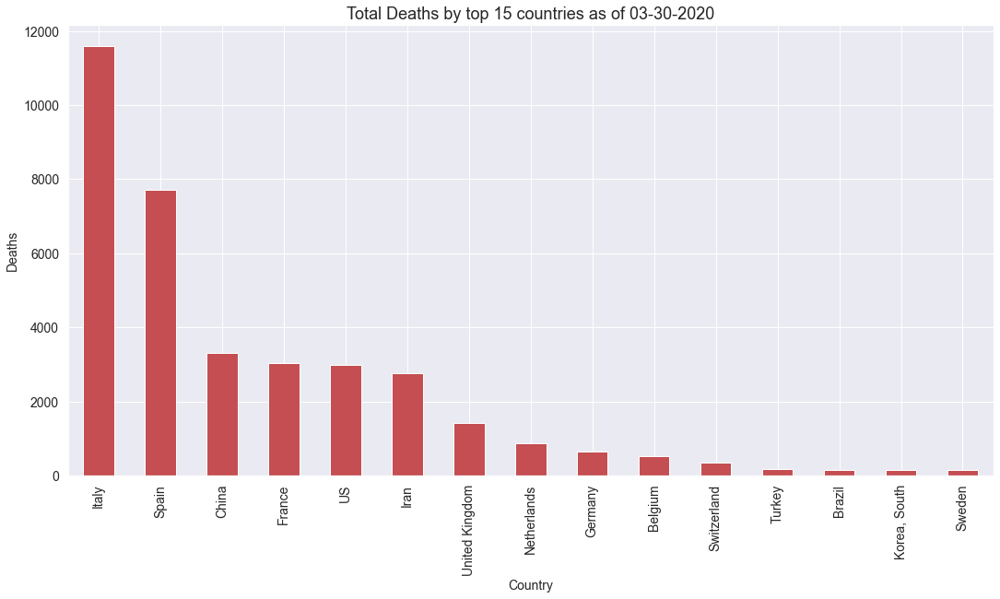
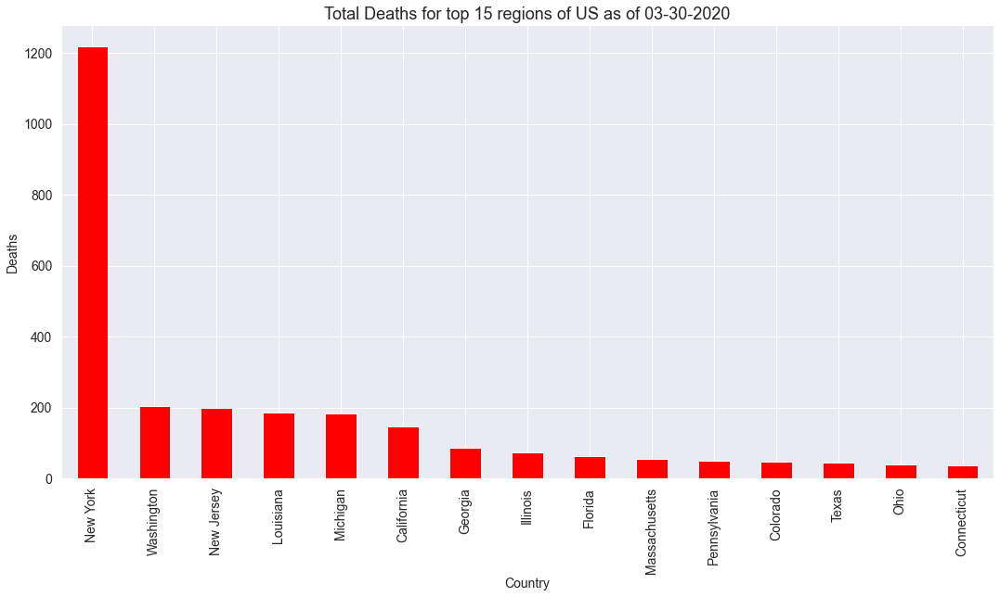
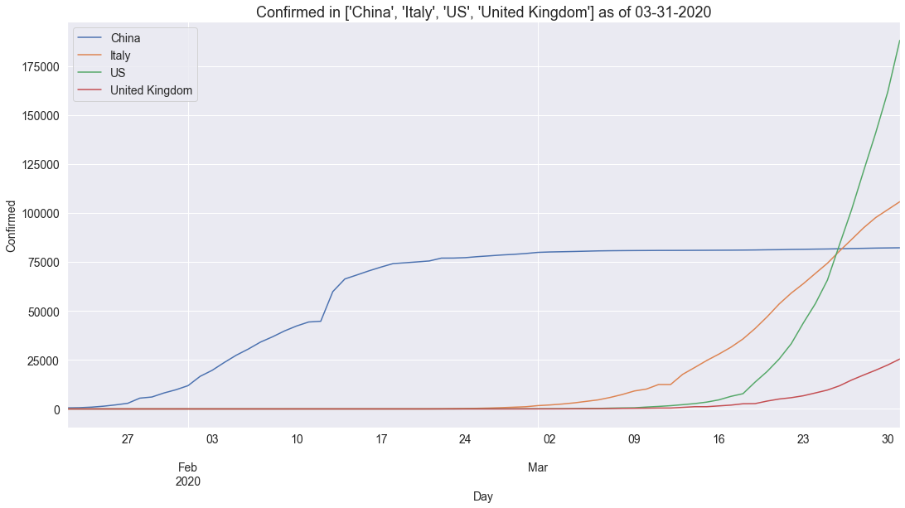
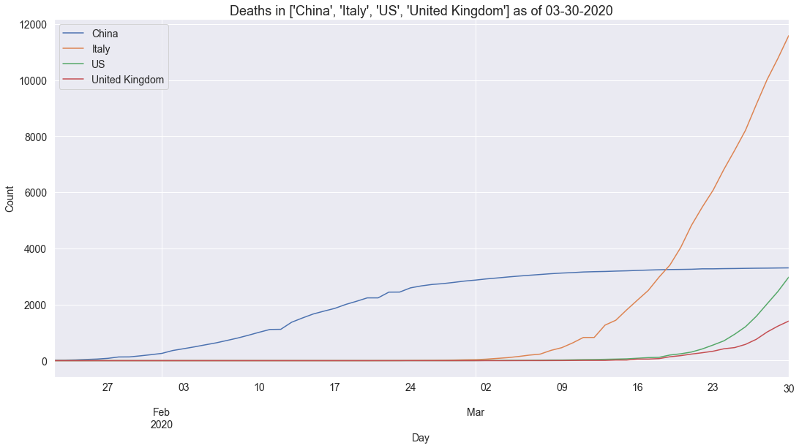
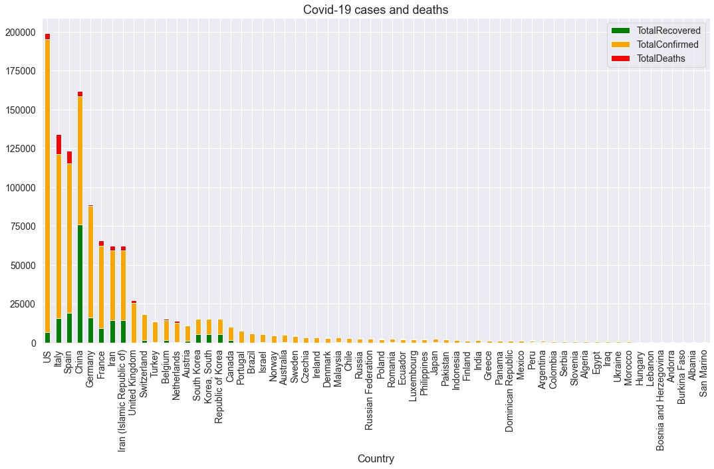
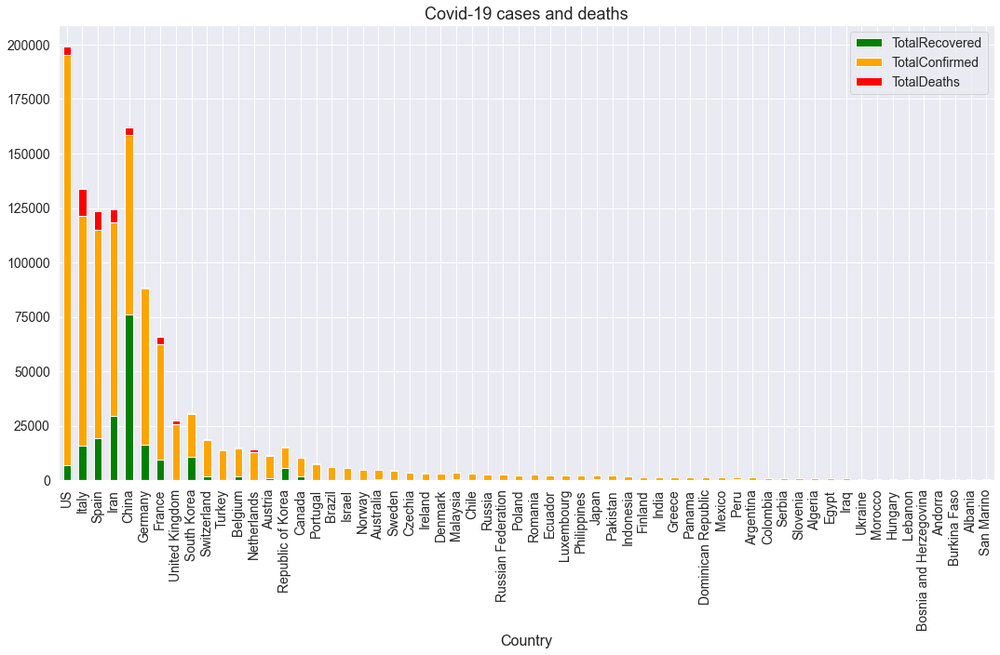
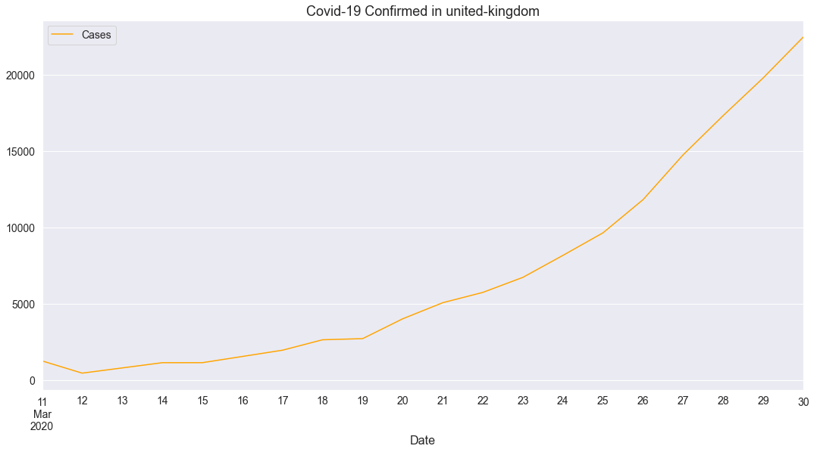
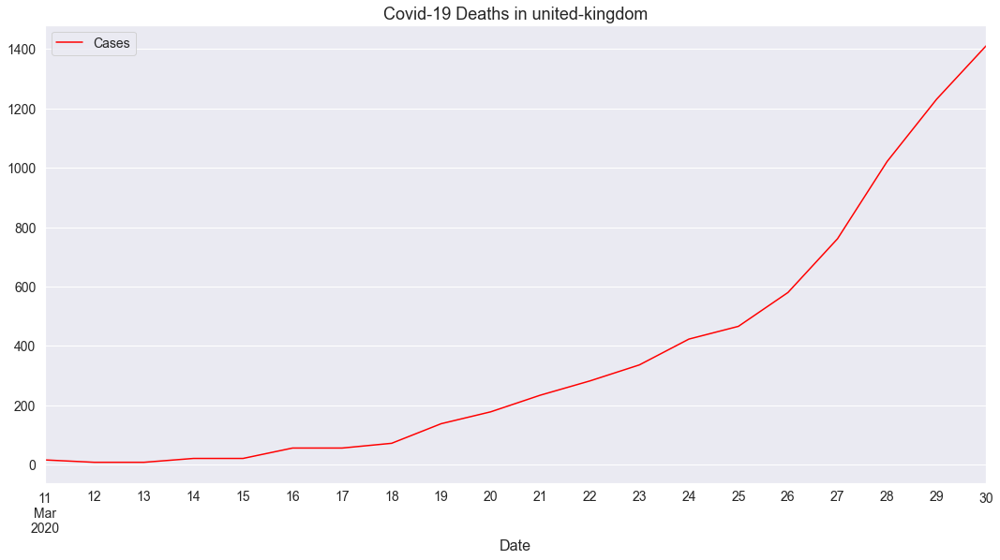

# covid <a name="top-of-covid-notebook"></a>
> Visualise the John Hopkins Covid-19 dataset.


## Contents
1. [Introduction](#covid-intro)
2. [Installation](#covid-install)
3. [Graphing current counts](#covid-current)
4. [Graphing time series counts](#covid-timeseries)
5. [Graphing current and time series counts using Covid API](#covid-api)

## 1. Introduction <a name="covid-intro"></a>
#### [back](#top-of-covid-notebook)

The `covid` module provides convenience utilities for graphing the covid-19 dataset published by John Hopkins University (JHU) [here](https://github.com/CSSEGISandData/COVID-19).  The JHU dataset is updated daily with the latest in separate time series csv files covering [here](https://github.com/CSSEGISandData/COVID-19/tree/master/csse_covid_19_data/csse_covid_19_time_series):
* `time_series_covid19_confirmed_global.csv`
* `time_series_covid19_deaths_global.csv`
* `time_series_covid19_recovered_global.csv`

Daily reports are kept in [this directory](https://github.com/CSSEGISandData/COVID-19/blob/master/csse_covid_19_data/csse_covid_19_daily_reports) and conform to the format `dd-mm-2020.csv`.

## 2. Installation <a name="covid-install"></a>
#### [back](#top-of-covid-notebook)

This code is not yet in PyPI.  You can clone the repo and the corresponding functions described below will all be available in the accompanying `covid` module.  The `covid` module has the following dependencies which will need to be pip installed: `requests`,`pandas`,`matplotlib`,`seaborn`

## 3. Graphing current counts <a name="covid-current"></a>
#### [back](#top-of-covid-notebook)

You can use `getCountriesDailyReport` to obtain a `pandas` dataframe `df` holding the latest values for each of `["Confirmed","Deaths","Recovered"]` by both `Province_State` and `Country_Region` as follows:

```python
df = getCountriesDailyReport(getYesterday())
```

You can view the structure of `df` as follows:

```python
n = 1
nrows,ncols = df.shape
print(f'df has {nrows} rows and {ncols} columns with column names {df.columns.to_list()}')
print(f'First {n} rows are:')
print(df.iloc[:n,:])
```

    df has 3439 rows and 12 columns with column names ['FIPS', 'Admin2', 'Province_State', 'Country_Region', 'Last_Update', 'Lat', 'Long_', 'Confirmed', 'Deaths', 'Recovered', 'Active', 'Combined_Key']
    First 1 rows are:
          FIPS     Admin2  Province_State Country_Region         Last_Update  \
    0  45001.0  Abbeville  South Carolina             US 2020-03-30 22:52:45   
    
             Lat      Long_  Confirmed  Deaths  Recovered  Active  \
    0  34.223334 -82.461707          3       0          0       0   
    
                        Combined_Key  
    0  Abbeville, South Carolina, US  


You can plot this data aggregated by country and `kind` as follows.  Note here that `setDefaults` configures graphs to be drawn using the [seaborn](https://seaborn.pydata.org/introduction.html) visualisation library or the `altair` visualisation library for the second graph:

```python
setDefaults()
plotCountriesDailyReport(getCountriesDailyReport(getYesterday()), topN=15, color='red', kind='Deaths',visualisation='altair')
plotCountriesDailyReport(getCountriesDailyReport(getYesterday()), topN=15, color='r', kind='Deaths')
```


<div id="altair-viz-82b970ea82354705b5e7fdcff790d450"></div>
<script type="text/javascript">
  (function(spec, embedOpt){
    const outputDiv = document.getElementById("altair-viz-82b970ea82354705b5e7fdcff790d450");
    const paths = {
      "vega": "https://cdn.jsdelivr.net/npm//vega@5?noext",
      "vega-lib": "https://cdn.jsdelivr.net/npm//vega-lib?noext",
      "vega-lite": "https://cdn.jsdelivr.net/npm//vega-lite@4.0.2?noext",
      "vega-embed": "https://cdn.jsdelivr.net/npm//vega-embed@6?noext",
    };

    function loadScript(lib) {
      return new Promise(function(resolve, reject) {
        var s = document.createElement('script');
        s.src = paths[lib];
        s.async = true;
        s.onload = () => resolve(paths[lib]);
        s.onerror = () => reject(`Error loading script: ${paths[lib]}`);
        document.getElementsByTagName("head")[0].appendChild(s);
      });
    }

    function showError(err) {
      outputDiv.innerHTML = `<div class="error" style="color:red;">${err}</div>`;
      throw err;
    }

    function displayChart(vegaEmbed) {
      vegaEmbed(outputDiv, spec, embedOpt)
        .catch(err => showError(`Javascript Error: ${err.message}<br>This usually means there's a typo in your chart specification. See the javascript console for the full traceback.`));
    }

    if(typeof define === "function" && define.amd) {
      requirejs.config({paths});
      require(["vega-embed"], displayChart, err => showError(`Error loading script: ${err.message}`));
    } else if (typeof vegaEmbed === "function") {
      displayChart(vegaEmbed);
    } else {
      loadScript("vega")
        .then(() => loadScript("vega-lite"))
        .then(() => loadScript("vega-embed"))
        .catch(showError)
        .then(() => displayChart(vegaEmbed));
    }
  })({"config": {"view": {"continuousWidth": 400, "continuousHeight": 300}}, "data": {"name": "data-f3105afe79b0abb4f73afe96e82a804b"}, "mark": {"type": "bar", "size": 30}, "encoding": {"color": {"value": "red"}, "opacity": {"value": 0.9}, "x": {"type": "nominal", "field": "Country", "sort": "-y"}, "y": {"type": "quantitative", "field": "Deaths"}}, "height": 450, "width": 1000, "$schema": "https://vega.github.io/schema/vega-lite/v4.0.2.json", "datasets": {"data-f3105afe79b0abb4f73afe96e82a804b": [{"Country": "Italy", "Deaths": 11591}, {"Country": "Spain", "Deaths": 7716}, {"Country": "China", "Deaths": 3308}, {"Country": "France", "Deaths": 3030}, {"Country": "US", "Deaths": 2978}, {"Country": "Iran", "Deaths": 2757}, {"Country": "United Kingdom", "Deaths": 1411}, {"Country": "Netherlands", "Deaths": 865}, {"Country": "Germany", "Deaths": 645}, {"Country": "Belgium", "Deaths": 513}, {"Country": "Switzerland", "Deaths": 359}, {"Country": "Turkey", "Deaths": 168}, {"Country": "Brazil", "Deaths": 159}, {"Country": "Korea, South", "Deaths": 158}, {"Country": "Sweden", "Deaths": 146}]}}, {"mode": "vega-lite"});
</script>





We can also dig into the breakdown per country if available as follows:

```python
plotCountryDailyReport(getCountriesDailyReport(getYesterday()), 'US',  topN=15, color='red', kind='Deaths', visualisation='altair')
plotCountryDailyReport(getCountriesDailyReport(getYesterday()), 'US',  topN=15, color='red', kind='Deaths')
```


<div id="altair-viz-c3c66d875805425c8324dceaf924f706"></div>
<script type="text/javascript">
  (function(spec, embedOpt){
    const outputDiv = document.getElementById("altair-viz-c3c66d875805425c8324dceaf924f706");
    const paths = {
      "vega": "https://cdn.jsdelivr.net/npm//vega@5?noext",
      "vega-lib": "https://cdn.jsdelivr.net/npm//vega-lib?noext",
      "vega-lite": "https://cdn.jsdelivr.net/npm//vega-lite@4.0.2?noext",
      "vega-embed": "https://cdn.jsdelivr.net/npm//vega-embed@6?noext",
    };

    function loadScript(lib) {
      return new Promise(function(resolve, reject) {
        var s = document.createElement('script');
        s.src = paths[lib];
        s.async = true;
        s.onload = () => resolve(paths[lib]);
        s.onerror = () => reject(`Error loading script: ${paths[lib]}`);
        document.getElementsByTagName("head")[0].appendChild(s);
      });
    }

    function showError(err) {
      outputDiv.innerHTML = `<div class="error" style="color:red;">${err}</div>`;
      throw err;
    }

    function displayChart(vegaEmbed) {
      vegaEmbed(outputDiv, spec, embedOpt)
        .catch(err => showError(`Javascript Error: ${err.message}<br>This usually means there's a typo in your chart specification. See the javascript console for the full traceback.`));
    }

    if(typeof define === "function" && define.amd) {
      requirejs.config({paths});
      require(["vega-embed"], displayChart, err => showError(`Error loading script: ${err.message}`));
    } else if (typeof vegaEmbed === "function") {
      displayChart(vegaEmbed);
    } else {
      loadScript("vega")
        .then(() => loadScript("vega-lite"))
        .then(() => loadScript("vega-embed"))
        .catch(showError)
        .then(() => displayChart(vegaEmbed));
    }
  })({"config": {"view": {"continuousWidth": 400, "continuousHeight": 300}}, "data": {"name": "data-0439d9289db28fa5227db7eb36b77d88"}, "mark": {"type": "bar", "size": 30}, "encoding": {"color": {"value": "red"}, "opacity": {"value": 0.9}, "x": {"type": "nominal", "field": "Province_State", "sort": "-y"}, "y": {"type": "quantitative", "field": "Deaths"}}, "height": 450, "width": 1000, "$schema": "https://vega.github.io/schema/vega-lite/v4.0.2.json", "datasets": {"data-0439d9289db28fa5227db7eb36b77d88": [{"Province_State": "New York", "Deaths": 1218}, {"Province_State": "Washington", "Deaths": 205}, {"Province_State": "New Jersey", "Deaths": 198}, {"Province_State": "Louisiana", "Deaths": 185}, {"Province_State": "Michigan", "Deaths": 184}, {"Province_State": "California", "Deaths": 146}, {"Province_State": "Georgia", "Deaths": 87}, {"Province_State": "Illinois", "Deaths": 73}, {"Province_State": "Florida", "Deaths": 63}, {"Province_State": "Massachusetts", "Deaths": 56}, {"Province_State": "Pennsylvania", "Deaths": 50}, {"Province_State": "Colorado", "Deaths": 47}, {"Province_State": "Texas", "Deaths": 45}, {"Province_State": "Ohio", "Deaths": 40}, {"Province_State": "Connecticut", "Deaths": 36}]}}, {"mode": "vega-lite"});
</script>





## 4. Graphing time series counts <a name="covid-timeseries"></a>
#### [back](#top-of-covid-notebook)

We can look at how infection and death counts have varied for a county over time if we aggregate by doing a `groupby` on `country`.  We should see an equal number of values per country following this aggregation:  

```python
df = procTimeSeriesConfirmed()
print(f'Found {df.shape} (rows, cols) of cols={df.columns.values}')
ddf = df.groupby('country')['Confirmed'].count().sort_values(ascending=True)
print(f'max={ddf.max()}, min={ddf.min()}, count={len(ddf)}')
```

    Found (12282, 2) (rows, cols) of cols=['country' 'Confirmed']
    max=69, min=69, count=178


Now we can plot a time series of confirmed cases of Covid-19 in China, Italy, US and UK as follows:

```python
plotCountriesTimeSeries(df, ['China', 'Italy', 'US', 'United Kingdom'], 'Confirmed')
```





And we can plot a time series of recorded deaths in these same countries as follows:

```python
plotCountriesTimeSeries(procTimeSeriesDeaths(), ['China', 'Italy', 'US', 'United Kingdom'], 'Deaths')
```





## 5. Graphing current and time series counts using Covid API <a name="covid-api"></a>
#### [back](#top-of-covid-notebook)

[This site](https://covid19api.com/) details an API that nicely wraps up the same JHU dataset and presents it as `json` via a REST API which allows us to go from API call to formatted graph showing cases and deaths by country as follows:

```python
plotCountriesDailyReportFromAPI()
```





Note that not all the country names are fully normalised - Iran and South Korea appear twice.  You can normalise the data by passing in a `normalise=True` flag:

```python
plotCountriesDailyReportFromAPI(normalised=True)
```





It's also possible to do timeseries representation using this API by country with `matplotlib` or `altair` as follows:

```python
plotCategoryByCountryFromAPI('Confirmed', 'united-kingdom', color='orange', visualisation='altair')
plotCategoryByCountryFromAPI('Confirmed', 'united-kingdom')
```


<div id="altair-viz-b2b56bbbac874b4faa8b2d36b939942f"></div>
<script type="text/javascript">
  (function(spec, embedOpt){
    const outputDiv = document.getElementById("altair-viz-b2b56bbbac874b4faa8b2d36b939942f");
    const paths = {
      "vega": "https://cdn.jsdelivr.net/npm//vega@5?noext",
      "vega-lib": "https://cdn.jsdelivr.net/npm//vega-lib?noext",
      "vega-lite": "https://cdn.jsdelivr.net/npm//vega-lite@4.0.2?noext",
      "vega-embed": "https://cdn.jsdelivr.net/npm//vega-embed@6?noext",
    };

    function loadScript(lib) {
      return new Promise(function(resolve, reject) {
        var s = document.createElement('script');
        s.src = paths[lib];
        s.async = true;
        s.onload = () => resolve(paths[lib]);
        s.onerror = () => reject(`Error loading script: ${paths[lib]}`);
        document.getElementsByTagName("head")[0].appendChild(s);
      });
    }

    function showError(err) {
      outputDiv.innerHTML = `<div class="error" style="color:red;">${err}</div>`;
      throw err;
    }

    function displayChart(vegaEmbed) {
      vegaEmbed(outputDiv, spec, embedOpt)
        .catch(err => showError(`Javascript Error: ${err.message}<br>This usually means there's a typo in your chart specification. See the javascript console for the full traceback.`));
    }

    if(typeof define === "function" && define.amd) {
      requirejs.config({paths});
      require(["vega-embed"], displayChart, err => showError(`Error loading script: ${err.message}`));
    } else if (typeof vegaEmbed === "function") {
      displayChart(vegaEmbed);
    } else {
      loadScript("vega")
        .then(() => loadScript("vega-lite"))
        .then(() => loadScript("vega-embed"))
        .catch(showError)
        .then(() => displayChart(vegaEmbed));
    }
  })({"config": {"view": {"continuousWidth": 400, "continuousHeight": 300}}, "data": {"name": "data-a816e1f6dd03193326e6d6bb092e0c75"}, "mark": "line", "encoding": {"color": {"value": "orange"}, "x": {"type": "temporal", "field": "Date"}, "y": {"type": "quantitative", "field": "Cases"}}, "height": 450, "width": 1000, "$schema": "https://vega.github.io/schema/vega-lite/v4.0.2.json", "datasets": {"data-a816e1f6dd03193326e6d6bb092e0c75": [{"Country": "United Kingdom", "Province": "", "Lat": 0, "Lon": 0, "Date": "2020-03-11T00:00:00+00:00", "Cases": 1259, "Status": "confirmed"}, {"Country": "United Kingdom", "Province": "", "Lat": 0, "Lon": 0, "Date": "2020-03-12T00:00:00+00:00", "Cases": 459, "Status": "confirmed"}, {"Country": "United Kingdom", "Province": "", "Lat": 0, "Lon": 0, "Date": "2020-03-13T00:00:00+00:00", "Cases": 801, "Status": "confirmed"}, {"Country": "United Kingdom", "Province": "", "Lat": 0, "Lon": 0, "Date": "2020-03-14T00:00:00+00:00", "Cases": 1143, "Status": "confirmed"}, {"Country": "United Kingdom", "Province": "", "Lat": 0, "Lon": 0, "Date": "2020-03-15T00:00:00+00:00", "Cases": 1144, "Status": "confirmed"}, {"Country": "United Kingdom", "Province": "", "Lat": 0, "Lon": 0, "Date": "2020-03-16T00:00:00+00:00", "Cases": 1551, "Status": "confirmed"}, {"Country": "United Kingdom", "Province": "", "Lat": 0, "Lon": 0, "Date": "2020-03-17T00:00:00+00:00", "Cases": 1960, "Status": "confirmed"}, {"Country": "United Kingdom", "Province": "", "Lat": 0, "Lon": 0, "Date": "2020-03-18T00:00:00+00:00", "Cases": 2642, "Status": "confirmed"}, {"Country": "United Kingdom", "Province": "", "Lat": 0, "Lon": 0, "Date": "2020-03-19T00:00:00+00:00", "Cases": 2716, "Status": "confirmed"}, {"Country": "United Kingdom", "Province": "", "Lat": 0, "Lon": 0, "Date": "2020-03-20T00:00:00+00:00", "Cases": 4014, "Status": "confirmed"}, {"Country": "United Kingdom", "Province": "", "Lat": 0, "Lon": 0, "Date": "2020-03-21T00:00:00+00:00", "Cases": 5067, "Status": "confirmed"}, {"Country": "United Kingdom", "Province": "", "Lat": 0, "Lon": 0, "Date": "2020-03-22T00:00:00+00:00", "Cases": 5741, "Status": "confirmed"}, {"Country": "United Kingdom", "Province": "", "Lat": 0, "Lon": 0, "Date": "2020-03-23T00:00:00+00:00", "Cases": 6726, "Status": "confirmed"}, {"Country": "United Kingdom", "Province": "", "Lat": 0, "Lon": 0, "Date": "2020-03-24T00:00:00+00:00", "Cases": 8164, "Status": "confirmed"}, {"Country": "United Kingdom", "Province": "", "Lat": 0, "Lon": 0, "Date": "2020-03-25T00:00:00+00:00", "Cases": 9640, "Status": "confirmed"}, {"Country": "United Kingdom", "Province": "", "Lat": 0, "Lon": 0, "Date": "2020-03-26T00:00:00+00:00", "Cases": 11812, "Status": "confirmed"}, {"Country": "United Kingdom", "Province": "", "Lat": 0, "Lon": 0, "Date": "2020-03-27T00:00:00+00:00", "Cases": 14745, "Status": "confirmed"}, {"Country": "United Kingdom", "Province": "", "Lat": 0, "Lon": 0, "Date": "2020-03-28T00:00:00+00:00", "Cases": 17312, "Status": "confirmed"}, {"Country": "United Kingdom", "Province": "", "Lat": 0, "Lon": 0, "Date": "2020-03-29T00:00:00+00:00", "Cases": 19780, "Status": "confirmed"}, {"Country": "United Kingdom", "Province": "", "Lat": 0, "Lon": 0, "Date": "2020-03-30T00:00:00+00:00", "Cases": 22453, "Status": "confirmed"}]}}, {"mode": "vega-lite"});
</script>





```python
plotCategoryByCountryFromAPI('Deaths', 'united-kingdom', color='red', visualisation='altair')
plotCategoryByCountryFromAPI('Deaths', 'united-kingdom', color='red')
```


<div id="altair-viz-7a48680226304e1aa18f439916055952"></div>
<script type="text/javascript">
  (function(spec, embedOpt){
    const outputDiv = document.getElementById("altair-viz-7a48680226304e1aa18f439916055952");
    const paths = {
      "vega": "https://cdn.jsdelivr.net/npm//vega@5?noext",
      "vega-lib": "https://cdn.jsdelivr.net/npm//vega-lib?noext",
      "vega-lite": "https://cdn.jsdelivr.net/npm//vega-lite@4.0.2?noext",
      "vega-embed": "https://cdn.jsdelivr.net/npm//vega-embed@6?noext",
    };

    function loadScript(lib) {
      return new Promise(function(resolve, reject) {
        var s = document.createElement('script');
        s.src = paths[lib];
        s.async = true;
        s.onload = () => resolve(paths[lib]);
        s.onerror = () => reject(`Error loading script: ${paths[lib]}`);
        document.getElementsByTagName("head")[0].appendChild(s);
      });
    }

    function showError(err) {
      outputDiv.innerHTML = `<div class="error" style="color:red;">${err}</div>`;
      throw err;
    }

    function displayChart(vegaEmbed) {
      vegaEmbed(outputDiv, spec, embedOpt)
        .catch(err => showError(`Javascript Error: ${err.message}<br>This usually means there's a typo in your chart specification. See the javascript console for the full traceback.`));
    }

    if(typeof define === "function" && define.amd) {
      requirejs.config({paths});
      require(["vega-embed"], displayChart, err => showError(`Error loading script: ${err.message}`));
    } else if (typeof vegaEmbed === "function") {
      displayChart(vegaEmbed);
    } else {
      loadScript("vega")
        .then(() => loadScript("vega-lite"))
        .then(() => loadScript("vega-embed"))
        .catch(showError)
        .then(() => displayChart(vegaEmbed));
    }
  })({"config": {"view": {"continuousWidth": 400, "continuousHeight": 300}}, "data": {"name": "data-6b99015e4f7491ac0b2189930f8a8207"}, "mark": "line", "encoding": {"color": {"value": "red"}, "x": {"type": "temporal", "field": "Date"}, "y": {"type": "quantitative", "field": "Cases"}}, "height": 450, "width": 1000, "$schema": "https://vega.github.io/schema/vega-lite/v4.0.2.json", "datasets": {"data-6b99015e4f7491ac0b2189930f8a8207": [{"Country": "United Kingdom", "Province": "", "Lat": 0, "Lon": 0, "Date": "2020-03-11T00:00:00+00:00", "Cases": 16, "Status": "deaths"}, {"Country": "United Kingdom", "Province": "", "Lat": 0, "Lon": 0, "Date": "2020-03-12T00:00:00+00:00", "Cases": 8, "Status": "deaths"}, {"Country": "United Kingdom", "Province": "", "Lat": 0, "Lon": 0, "Date": "2020-03-13T00:00:00+00:00", "Cases": 8, "Status": "deaths"}, {"Country": "United Kingdom", "Province": "", "Lat": 0, "Lon": 0, "Date": "2020-03-14T00:00:00+00:00", "Cases": 21, "Status": "deaths"}, {"Country": "United Kingdom", "Province": "", "Lat": 0, "Lon": 0, "Date": "2020-03-15T00:00:00+00:00", "Cases": 21, "Status": "deaths"}, {"Country": "United Kingdom", "Province": "", "Lat": 0, "Lon": 0, "Date": "2020-03-16T00:00:00+00:00", "Cases": 56, "Status": "deaths"}, {"Country": "United Kingdom", "Province": "", "Lat": 0, "Lon": 0, "Date": "2020-03-17T00:00:00+00:00", "Cases": 56, "Status": "deaths"}, {"Country": "United Kingdom", "Province": "", "Lat": 0, "Lon": 0, "Date": "2020-03-18T00:00:00+00:00", "Cases": 72, "Status": "deaths"}, {"Country": "United Kingdom", "Province": "", "Lat": 0, "Lon": 0, "Date": "2020-03-19T00:00:00+00:00", "Cases": 138, "Status": "deaths"}, {"Country": "United Kingdom", "Province": "", "Lat": 0, "Lon": 0, "Date": "2020-03-20T00:00:00+00:00", "Cases": 178, "Status": "deaths"}, {"Country": "United Kingdom", "Province": "", "Lat": 0, "Lon": 0, "Date": "2020-03-21T00:00:00+00:00", "Cases": 234, "Status": "deaths"}, {"Country": "United Kingdom", "Province": "", "Lat": 0, "Lon": 0, "Date": "2020-03-22T00:00:00+00:00", "Cases": 282, "Status": "deaths"}, {"Country": "United Kingdom", "Province": "", "Lat": 0, "Lon": 0, "Date": "2020-03-23T00:00:00+00:00", "Cases": 336, "Status": "deaths"}, {"Country": "United Kingdom", "Province": "", "Lat": 0, "Lon": 0, "Date": "2020-03-24T00:00:00+00:00", "Cases": 423, "Status": "deaths"}, {"Country": "United Kingdom", "Province": "", "Lat": 0, "Lon": 0, "Date": "2020-03-25T00:00:00+00:00", "Cases": 466, "Status": "deaths"}, {"Country": "United Kingdom", "Province": "", "Lat": 0, "Lon": 0, "Date": "2020-03-26T00:00:00+00:00", "Cases": 580, "Status": "deaths"}, {"Country": "United Kingdom", "Province": "", "Lat": 0, "Lon": 0, "Date": "2020-03-27T00:00:00+00:00", "Cases": 761, "Status": "deaths"}, {"Country": "United Kingdom", "Province": "", "Lat": 0, "Lon": 0, "Date": "2020-03-28T00:00:00+00:00", "Cases": 1021, "Status": "deaths"}, {"Country": "United Kingdom", "Province": "", "Lat": 0, "Lon": 0, "Date": "2020-03-29T00:00:00+00:00", "Cases": 1231, "Status": "deaths"}, {"Country": "United Kingdom", "Province": "", "Lat": 0, "Lon": 0, "Date": "2020-03-30T00:00:00+00:00", "Cases": 1411, "Status": "deaths"}]}}, {"mode": "vega-lite"});
</script>





We can also look at the US data:

```python
plotCategoryByCountryFromAPI('Deaths', 'us', color='red', visualisation='altair')
plotCategoryByCountryFromAPI('Deaths', 'us', color='red', visualisation='matplotlib')
```


<div id="altair-viz-2f3e3a6001e34c2da0ac67618c096b93"></div>
<script type="text/javascript">
  (function(spec, embedOpt){
    const outputDiv = document.getElementById("altair-viz-2f3e3a6001e34c2da0ac67618c096b93");
    const paths = {
      "vega": "https://cdn.jsdelivr.net/npm//vega@5?noext",
      "vega-lib": "https://cdn.jsdelivr.net/npm//vega-lib?noext",
      "vega-lite": "https://cdn.jsdelivr.net/npm//vega-lite@4.0.2?noext",
      "vega-embed": "https://cdn.jsdelivr.net/npm//vega-embed@6?noext",
    };

    function loadScript(lib) {
      return new Promise(function(resolve, reject) {
        var s = document.createElement('script');
        s.src = paths[lib];
        s.async = true;
        s.onload = () => resolve(paths[lib]);
        s.onerror = () => reject(`Error loading script: ${paths[lib]}`);
        document.getElementsByTagName("head")[0].appendChild(s);
      });
    }

    function showError(err) {
      outputDiv.innerHTML = `<div class="error" style="color:red;">${err}</div>`;
      throw err;
    }

    function displayChart(vegaEmbed) {
      vegaEmbed(outputDiv, spec, embedOpt)
        .catch(err => showError(`Javascript Error: ${err.message}<br>This usually means there's a typo in your chart specification. See the javascript console for the full traceback.`));
    }

    if(typeof define === "function" && define.amd) {
      requirejs.config({paths});
      require(["vega-embed"], displayChart, err => showError(`Error loading script: ${err.message}`));
    } else if (typeof vegaEmbed === "function") {
      displayChart(vegaEmbed);
    } else {
      loadScript("vega")
        .then(() => loadScript("vega-lite"))
        .then(() => loadScript("vega-embed"))
        .catch(showError)
        .then(() => displayChart(vegaEmbed));
    }
  })({"config": {"view": {"continuousWidth": 400, "continuousHeight": 300}}, "data": {"name": "data-0f5b7471b9a15e0de00f0d64506a80b7"}, "mark": "line", "encoding": {"color": {"value": "red"}, "x": {"type": "temporal", "field": "Date"}, "y": {"type": "quantitative", "field": "Cases"}}, "height": 450, "width": 1000, "$schema": "https://vega.github.io/schema/vega-lite/v4.0.2.json", "datasets": {"data-0f5b7471b9a15e0de00f0d64506a80b7": [{"Country": "US", "Province": "", "Lat": 0, "Lon": 0, "Date": "2020-01-22T00:00:00+00:00", "Cases": 0, "Status": "deaths"}, {"Country": "US", "Province": "", "Lat": 0, "Lon": 0, "Date": "2020-01-23T00:00:00+00:00", "Cases": 0, "Status": "deaths"}, {"Country": "US", "Province": "", "Lat": 0, "Lon": 0, "Date": "2020-01-24T00:00:00+00:00", "Cases": 0, "Status": "deaths"}, {"Country": "US", "Province": "", "Lat": 0, "Lon": 0, "Date": "2020-01-25T00:00:00+00:00", "Cases": 0, "Status": "deaths"}, {"Country": "US", "Province": "", "Lat": 0, "Lon": 0, "Date": "2020-01-26T00:00:00+00:00", "Cases": 0, "Status": "deaths"}, {"Country": "US", "Province": "", "Lat": 0, "Lon": 0, "Date": "2020-01-27T00:00:00+00:00", "Cases": 0, "Status": "deaths"}, {"Country": "US", "Province": "", "Lat": 0, "Lon": 0, "Date": "2020-01-28T00:00:00+00:00", "Cases": 0, "Status": "deaths"}, {"Country": "US", "Province": "", "Lat": 0, "Lon": 0, "Date": "2020-01-29T00:00:00+00:00", "Cases": 0, "Status": "deaths"}, {"Country": "US", "Province": "", "Lat": 0, "Lon": 0, "Date": "2020-01-30T00:00:00+00:00", "Cases": 0, "Status": "deaths"}, {"Country": "US", "Province": "", "Lat": 0, "Lon": 0, "Date": "2020-01-31T00:00:00+00:00", "Cases": 0, "Status": "deaths"}, {"Country": "US", "Province": "", "Lat": 0, "Lon": 0, "Date": "2020-02-01T00:00:00+00:00", "Cases": 0, "Status": "deaths"}, {"Country": "US", "Province": "", "Lat": 0, "Lon": 0, "Date": "2020-02-02T00:00:00+00:00", "Cases": 0, "Status": "deaths"}, {"Country": "US", "Province": "", "Lat": 0, "Lon": 0, "Date": "2020-02-03T00:00:00+00:00", "Cases": 0, "Status": "deaths"}, {"Country": "US", "Province": "", "Lat": 0, "Lon": 0, "Date": "2020-02-04T00:00:00+00:00", "Cases": 0, "Status": "deaths"}, {"Country": "US", "Province": "", "Lat": 0, "Lon": 0, "Date": "2020-02-05T00:00:00+00:00", "Cases": 0, "Status": "deaths"}, {"Country": "US", "Province": "", "Lat": 0, "Lon": 0, "Date": "2020-02-06T00:00:00+00:00", "Cases": 0, "Status": "deaths"}, {"Country": "US", "Province": "", "Lat": 0, "Lon": 0, "Date": "2020-02-07T00:00:00+00:00", "Cases": 0, "Status": "deaths"}, {"Country": "US", "Province": "", "Lat": 0, "Lon": 0, "Date": "2020-02-08T00:00:00+00:00", "Cases": 0, "Status": "deaths"}, {"Country": "US", "Province": "", "Lat": 0, "Lon": 0, "Date": "2020-02-09T00:00:00+00:00", "Cases": 0, "Status": "deaths"}, {"Country": "US", "Province": "", "Lat": 0, "Lon": 0, "Date": "2020-02-10T00:00:00+00:00", "Cases": 0, "Status": "deaths"}, {"Country": "US", "Province": "", "Lat": 0, "Lon": 0, "Date": "2020-02-11T00:00:00+00:00", "Cases": 0, "Status": "deaths"}, {"Country": "US", "Province": "", "Lat": 0, "Lon": 0, "Date": "2020-02-12T00:00:00+00:00", "Cases": 0, "Status": "deaths"}, {"Country": "US", "Province": "", "Lat": 0, "Lon": 0, "Date": "2020-02-13T00:00:00+00:00", "Cases": 0, "Status": "deaths"}, {"Country": "US", "Province": "", "Lat": 0, "Lon": 0, "Date": "2020-02-14T00:00:00+00:00", "Cases": 0, "Status": "deaths"}, {"Country": "US", "Province": "", "Lat": 0, "Lon": 0, "Date": "2020-02-15T00:00:00+00:00", "Cases": 0, "Status": "deaths"}, {"Country": "US", "Province": "", "Lat": 0, "Lon": 0, "Date": "2020-02-16T00:00:00+00:00", "Cases": 0, "Status": "deaths"}, {"Country": "US", "Province": "", "Lat": 0, "Lon": 0, "Date": "2020-02-17T00:00:00+00:00", "Cases": 0, "Status": "deaths"}, {"Country": "US", "Province": "", "Lat": 0, "Lon": 0, "Date": "2020-02-18T00:00:00+00:00", "Cases": 0, "Status": "deaths"}, {"Country": "US", "Province": "", "Lat": 0, "Lon": 0, "Date": "2020-02-19T00:00:00+00:00", "Cases": 0, "Status": "deaths"}, {"Country": "US", "Province": "", "Lat": 0, "Lon": 0, "Date": "2020-02-20T00:00:00+00:00", "Cases": 0, "Status": "deaths"}, {"Country": "US", "Province": "", "Lat": 0, "Lon": 0, "Date": "2020-02-21T00:00:00+00:00", "Cases": 0, "Status": "deaths"}, {"Country": "US", "Province": "", "Lat": 0, "Lon": 0, "Date": "2020-02-22T00:00:00+00:00", "Cases": 0, "Status": "deaths"}, {"Country": "US", "Province": "", "Lat": 0, "Lon": 0, "Date": "2020-02-23T00:00:00+00:00", "Cases": 0, "Status": "deaths"}, {"Country": "US", "Province": "", "Lat": 0, "Lon": 0, "Date": "2020-02-24T00:00:00+00:00", "Cases": 0, "Status": "deaths"}, {"Country": "US", "Province": "", "Lat": 0, "Lon": 0, "Date": "2020-02-25T00:00:00+00:00", "Cases": 0, "Status": "deaths"}, {"Country": "US", "Province": "", "Lat": 0, "Lon": 0, "Date": "2020-02-26T00:00:00+00:00", "Cases": 0, "Status": "deaths"}, {"Country": "US", "Province": "", "Lat": 0, "Lon": 0, "Date": "2020-02-27T00:00:00+00:00", "Cases": 0, "Status": "deaths"}, {"Country": "US", "Province": "", "Lat": 0, "Lon": 0, "Date": "2020-02-28T00:00:00+00:00", "Cases": 0, "Status": "deaths"}, {"Country": "US", "Province": "", "Lat": 0, "Lon": 0, "Date": "2020-02-29T00:00:00+00:00", "Cases": 1, "Status": "deaths"}, {"Country": "US", "Province": "", "Lat": 0, "Lon": 0, "Date": "2020-03-01T00:00:00+00:00", "Cases": 1, "Status": "deaths"}, {"Country": "US", "Province": "", "Lat": 0, "Lon": 0, "Date": "2020-03-02T00:00:00+00:00", "Cases": 6, "Status": "deaths"}, {"Country": "US", "Province": "", "Lat": 0, "Lon": 0, "Date": "2020-03-03T00:00:00+00:00", "Cases": 7, "Status": "deaths"}, {"Country": "US", "Province": "", "Lat": 0, "Lon": 0, "Date": "2020-03-04T00:00:00+00:00", "Cases": 11, "Status": "deaths"}, {"Country": "US", "Province": "", "Lat": 0, "Lon": 0, "Date": "2020-03-05T00:00:00+00:00", "Cases": 12, "Status": "deaths"}, {"Country": "US", "Province": "", "Lat": 0, "Lon": 0, "Date": "2020-03-06T00:00:00+00:00", "Cases": 14, "Status": "deaths"}, {"Country": "US", "Province": "", "Lat": 0, "Lon": 0, "Date": "2020-03-07T00:00:00+00:00", "Cases": 17, "Status": "deaths"}, {"Country": "US", "Province": "", "Lat": 0, "Lon": 0, "Date": "2020-03-08T00:00:00+00:00", "Cases": 21, "Status": "deaths"}, {"Country": "US", "Province": "", "Lat": 0, "Lon": 0, "Date": "2020-03-09T00:00:00+00:00", "Cases": 22, "Status": "deaths"}, {"Country": "US", "Province": "", "Lat": 0, "Lon": 0, "Date": "2020-03-10T00:00:00+00:00", "Cases": 28, "Status": "deaths"}, {"Country": "US", "Province": "", "Lat": 0, "Lon": 0, "Date": "2020-03-11T00:00:00+00:00", "Cases": 37, "Status": "deaths"}, {"Country": "US", "Province": "", "Lat": 0, "Lon": 0, "Date": "2020-03-12T00:00:00+00:00", "Cases": 40, "Status": "deaths"}, {"Country": "US", "Province": "", "Lat": 0, "Lon": 0, "Date": "2020-03-13T00:00:00+00:00", "Cases": 47, "Status": "deaths"}, {"Country": "US", "Province": "", "Lat": 0, "Lon": 0, "Date": "2020-03-14T00:00:00+00:00", "Cases": 54, "Status": "deaths"}, {"Country": "US", "Province": "", "Lat": 0, "Lon": 0, "Date": "2020-03-15T00:00:00+00:00", "Cases": 63, "Status": "deaths"}, {"Country": "US", "Province": "", "Lat": 0, "Lon": 0, "Date": "2020-03-16T00:00:00+00:00", "Cases": 85, "Status": "deaths"}, {"Country": "US", "Province": "", "Lat": 0, "Lon": 0, "Date": "2020-03-17T00:00:00+00:00", "Cases": 108, "Status": "deaths"}, {"Country": "US", "Province": "", "Lat": 0, "Lon": 0, "Date": "2020-03-18T00:00:00+00:00", "Cases": 118, "Status": "deaths"}, {"Country": "US", "Province": "", "Lat": 0, "Lon": 0, "Date": "2020-03-19T00:00:00+00:00", "Cases": 200, "Status": "deaths"}, {"Country": "US", "Province": "", "Lat": 0, "Lon": 0, "Date": "2020-03-20T00:00:00+00:00", "Cases": 244, "Status": "deaths"}, {"Country": "US", "Province": "", "Lat": 0, "Lon": 0, "Date": "2020-03-21T00:00:00+00:00", "Cases": 307, "Status": "deaths"}, {"Country": "US", "Province": "", "Lat": 0, "Lon": 0, "Date": "2020-03-22T00:00:00+00:00", "Cases": 417, "Status": "deaths"}, {"Country": "US", "Province": "", "Lat": 0, "Lon": 0, "Date": "2020-03-23T00:00:00+00:00", "Cases": 552, "Status": "deaths"}, {"Country": "US", "Province": "", "Lat": 0, "Lon": 0, "Date": "2020-03-24T00:00:00+00:00", "Cases": 706, "Status": "deaths"}, {"Country": "US", "Province": "", "Lat": 0, "Lon": 0, "Date": "2020-03-25T00:00:00+00:00", "Cases": 942, "Status": "deaths"}, {"Country": "US", "Province": "", "Lat": 0, "Lon": 0, "Date": "2020-03-26T00:00:00+00:00", "Cases": 1209, "Status": "deaths"}, {"Country": "US", "Province": "", "Lat": 0, "Lon": 0, "Date": "2020-03-27T00:00:00+00:00", "Cases": 1581, "Status": "deaths"}, {"Country": "US", "Province": "", "Lat": 0, "Lon": 0, "Date": "2020-03-28T00:00:00+00:00", "Cases": 2026, "Status": "deaths"}, {"Country": "US", "Province": "", "Lat": 0, "Lon": 0, "Date": "2020-03-29T00:00:00+00:00", "Cases": 2467, "Status": "deaths"}, {"Country": "US", "Province": "", "Lat": 0, "Lon": 0, "Date": "2020-03-30T00:00:00+00:00", "Cases": 2978, "Status": "deaths"}]}}, {"mode": "vega-lite"});
</script>


